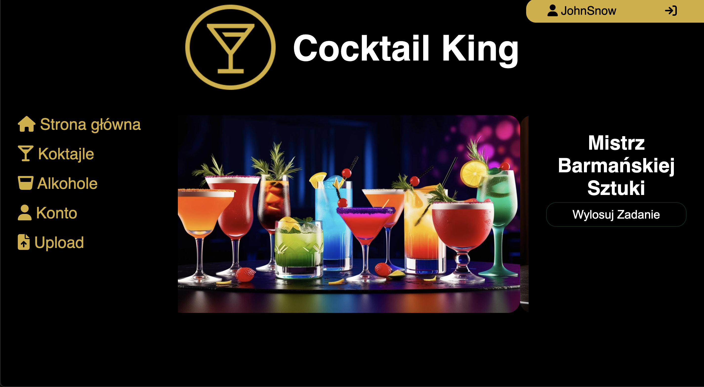
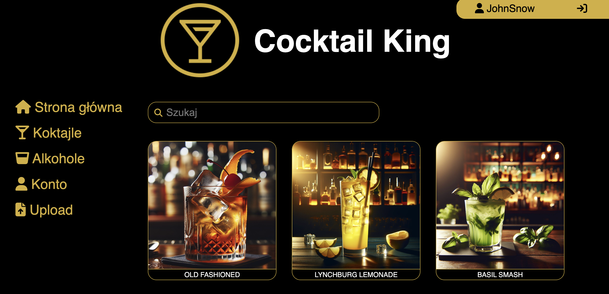
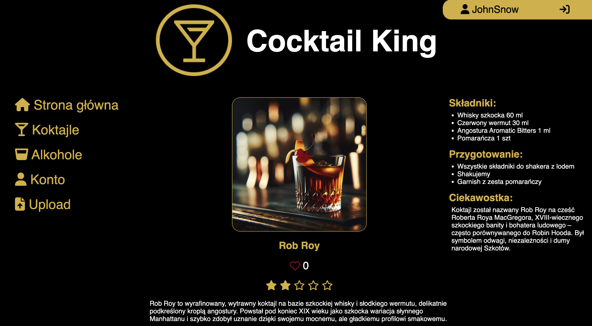
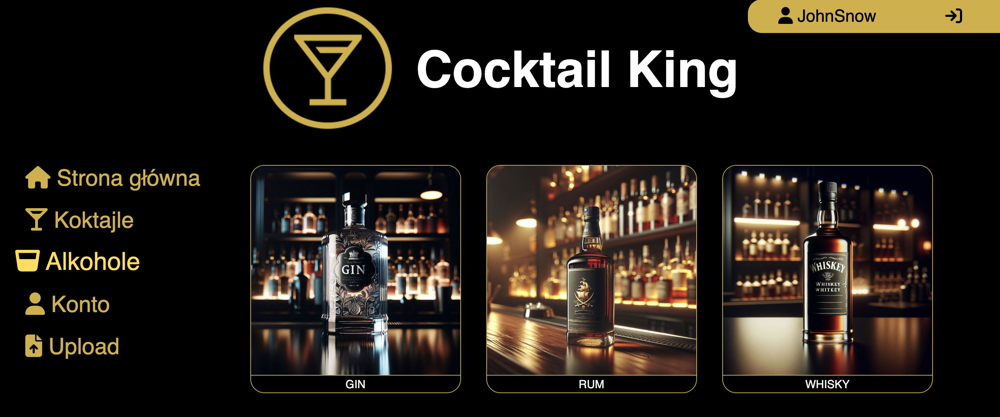

# Cocktail King
Aplikacja stworzona z myślą o miłośnikach koktajli, drinków i szeroko pojętej kultury barmańskiej. To idealne narzędzie zarówno dla amatorów, którzy chcą zaimponować znajomym na imprezie, jak i dla bardziej doświadczonych entuzjastów miksologii.
setki przepisów na koktajle, listy składników, porady barmańskie oraz ciekawostki o pochodzeniu i historii najpopularniejszych alkoholi. Dzięki tej aplikacji nie tylko przygotujesz idealnego drinka, ale też zabłyśniesz wiedzą towarzyską.

## Funkcje
- Przeglądanie listy koktajli i alkoholi
- Dostęp do przepisów, opisów oraz ciekawostek na temat koktajli
- Dodawanie nowych koktajli do bazy danych
- Mechanizm logowania użytkownika
- Obsługa sesji użytkownika

## Wymagania
- Docker zainstalowany na komputerze

## Uruchomienie
Przed uruchomieniem aplikacji, w katalogu głównym projektu należy utworzyć plik config.php i zdefiniować w nim poniższe stałe, zgodnie z konfiguracją bazy danych PostgreSQL (np. z pliku Dockerfile):
const USERNAME = 'twoja_nazwa_uzytkownika';   // Nazwa użytkownika do logowania w pgAdmin
const PASSWORD = 'twoje_haslo';               // Hasło użytkownika
const HOST = 'adres_IP_kontenera';            // Adres IPv4 kontenera z bazą danych (np. "nazwa kontenera" lub "172.x.x.x")
const DATABASE = 'nazwa_bazy_danych';         // Nazwa bazy danych

W terminalu, w głównym katalogu projektu, uruchom kontenery:
- docker-compose up
Po uruchomieniu:
- Aplikacja dostępna jest pod adresem: http://localhost:8080
- Panel administracyjny pgAdmin (do zarządzania bazą PostgreSQL): http://localhost:5050
Aby wyłączyć kontenery w katalogu głównym aplikacji wydaj polecenie:
- docker-compose down

## Technologie
Projekt został zbudowany w oparciu o nowoczesny stos technologiczny:
- HTML, CSS – responsywny i estetyczny interfejs użytkownika
- JavaScript – dynamiczna obsługa finterfejsu, frontend
- PHP – logika aplikacji po stronie serwera, backend
- PostgreSQL – relacyjna baza danych do przechowywania przepisów, składników oraz użytkowników
- Docker – ułatwione wdrażanie i konteneryzacja środowiska

## Zrzuty ekranu

## Testowanie
Na ten moment aplikacja nie zawiera zautomatyzowanych testów. Testy manualne są wykonywane przez użytkownika w środowisku lokalnym.

## Licencja
Projekt stworzony do celów edukacyjnych. Brak formalnej licencji.

## Autorzy
Wiktor Sztefko – projekt, kod, dokumentacja  
[wiktor.sztefko@gmail.com](mailto:wiktor.sztefko@gmail.com)

